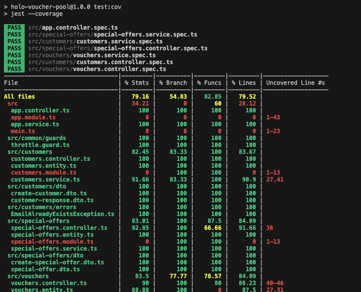
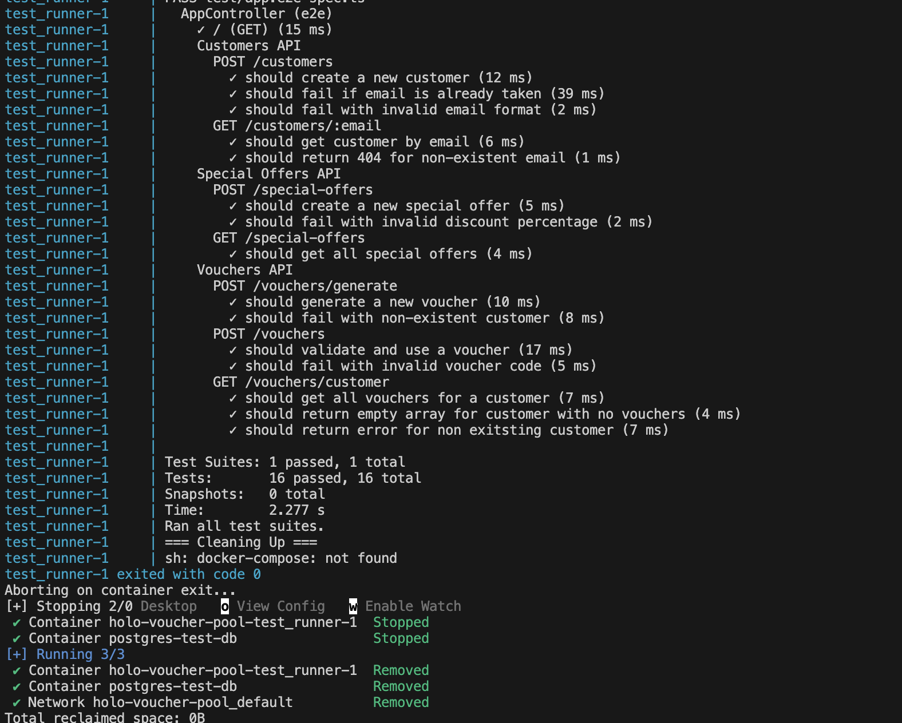

> Hint, to be honest, AI did a great job here, so for the what matters go directly to (Features, Docker Setup -> API Documentation, Rate Limiting & end to end testing)

## Description

Voucher Pool API with NestJS  
A REST API built using NestJS and PostgreSQL for managing vouchers. This API allows businesses to create and validate voucher codes for customers to receive special discounts.

## Features

- **Generate Voucher Codes** for each customer.
- **Validate Voucher Codes** with email and track usage.
- **Fetch Valid Voucher Codes** for a customer.
- **Rate Limiting** to protect against brute-force attacks.
- Modular and scalable architecture.
- Follows best practices with TypeScript, ESLint, and Prettier.
- **Dockerized** for easy deployment.
- **API Documentation** with Swagger.
- **End-to-End Testing** with a test container for the database.

### Prerequisites

- Node.js (v18 or later)
- PostgreSQL (v15 or later)
- Docker (optional, for running the database)

## Project setup

```bash
$ npm install
```

## Compile and run the project

```bash
# development mode
$ npm run start

# watch mode
$ npm run start:dev

# production mode
$ npm run start:prod
```

## Run tests (Unit tests)

```bash
# unit tests
$ npm run test

# test coverage > to be improved more
$ npm run test:cov
```



## Run tests (E2E using a test container for the Database)

This test container will spin up a PostgreSQL database and run the end to end sequence of tests against it.

```bash
# Start the testing environment
npm run test:ci
```

The `test:ci` command will:

1. Start the test containers
1. Run all E2E tests
1. Display test results
1. Automatically clean up by removing db container



## Docker Setup

The project includes two Docker Compose configurations for different environments:

### Development Environment

```bash
# Start the development environment
docker-compose -f docker-compose.dev.yml up -d

# Stop the development environment
docker-compose -f docker-compose.dev.yml down
```

#### Features:

- Hot reload enabled
- Source code mounted as volume
- Swagger API docs
- Node modules mounted as volume

#### API Documentation

The API documentation (Swagger UI) is available at: `http://localhost:3045/api-docs`

Note: The API documentation is only available in development mode (`NODE_ENV=development`).

### Production Environment

```bash
# Start the production environment
docker-compose up -d

# Stop the production environment
docker-compose down
```

#### Features:

- Optimized for production use
- No source code mounting
- No Swagger API docs
- No development dependencies

## Quick Installation

```bash
# Clone the repository
git clone https://github.com/ahmedsaberellaithy/holo-voucher-pool.git

# Change directory
cd holo-voucher-pool

# Install dependencies or skip this and directly use docker-compose
npm install
# Build the Docker image
docker-compose up --build
```

## Environment Variables

Make sure to set the following environment variables in the `.env` file or Docker environment:

```plaintext
DB_HOST=localhost
DB_PORT=5432
DB_USER=your_db_user
DB_PASS=your_db_password
DB_NAME=voucher_pool
THROTTLE_TTL=1000
THROTTLE_LIMIT=10
```

## Rate Limiting

This application implements rate limiting using `@nestjs/throttler` to protect against brute-force attacks. The rate limiting configuration is as follows:

- **TTL (Time-To-Live)**: `THROTTLE_TTL` (default: 1000ms)
- **Request Limit**: `THROTTLE_LIMIT` (default: 10 requests per second)

These values can be configured through environment variables in your `.env` file or Docker environment.

For more information about NestJS rate limiting, see the [official documentation](https://docs.nestjs.com/security/rate-limiting).

## License

Nest is [MIT licensed](https://github.com/nestjs/nest/blob/master/LICENSE).
